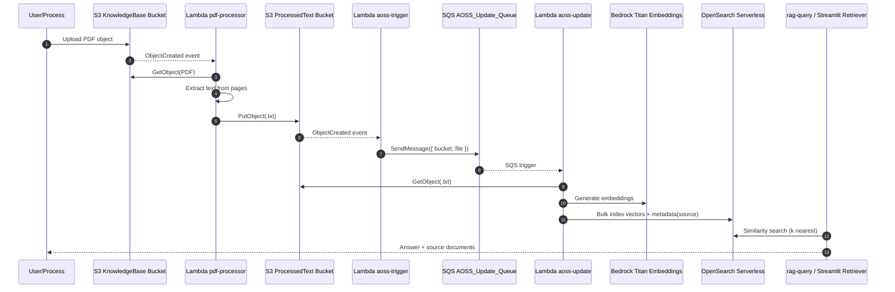

# Ingestion Pipeline (PDF -> Text -> Vectors -> Retrieval)

This document describes the end-to-end ingestion flow used in this project.

## Overview

The pipeline is event-driven and runs in three ingestion stages:

1. PDF upload to the knowledge-base S3 bucket
2. PDF text extraction into a processed-text S3 bucket
3. Vector indexing of processed text into OpenSearch Serverless

At query time, the RAG app/retriever reads vectors from OpenSearch and returns grounded answers with sources.

## Main Components

- CDK infrastructure wiring: `lib/base-infra-stack.ts`
- PDF processor Lambda: `lambda/pdf-processor/lambda_function.py`
- Trigger Lambda (processed text -> SQS): `lambda/aoss-trigger/app.py`
- Vector indexer Lambda (SQS -> OpenSearch): `lambda/aoss-update/app.py`
- Query API Lambda: `lambda/rag-query/app.py`
- Local app entry point: `rag-app/app.py`

## Sequence Diagram

## Stage-by-Stage Details

### Stage A: PDF Upload

PDFs enter the knowledge-base bucket either by:

- Manual/programmatic S3 upload (console/CLI/script), or
- CDK seed deployment from local `knowledgebase/` folder

S3 emits `ObjectCreated` notification for each new PDF.

### Stage B: PDF -> TXT

File: `lambda/pdf-processor/lambda_function.py`

Responsibilities:

- Validate event structure and source bucket
- Download uploaded PDF
- Parse pages with `pypdf`
- Concatenate extracted text
- Write `.txt` output to processed bucket (same stem)

Output naming convention:

- `example.pdf` -> `example.txt`

### Stage C: TXT Event -> SQS Message

File: `lambda/aoss-trigger/app.py`

Responsibilities:

- Validate processed-bucket object-created events
- Push an SQS message to `AOSS_Update_Queue` with payload:
  - `bucket`: processed text bucket name
  - `file`: processed `.txt` key

This stage decouples extraction from vector indexing and smooths burst traffic.

### Stage D: SQS -> OpenSearch Vector Index

File: `lambda/aoss-update/app.py`

Responsibilities:

- Consume SQS message
- Fetch processed text from S3
- Create embedding vectors with Bedrock Titan (`amazon.titan-embed-text-v2:0`)
- Index vectors/documents to OpenSearch Serverless
- Store source metadata as `s3://<bucket>/<key>` for traceability

## Retrieval Path

Retrieval components:

- Query Lambda: `lambda/rag-query/app.py`
- Streamlit app path: `rag-app/app.py` and `rag-app/aoss_chat_bedrock.py`

Behavior:

- Retriever performs vector similarity search in OpenSearch
- Returned source documents are surfaced in response payload/UI
- Responses can include source URIs and excerpts

## Operational Notes

### Eventual Timing

Typical ingestion latency is seconds, but may vary due to:

- S3 notification timing
- SQS queue delay/backoff
- Lambda cold starts
- OpenSearch indexing throughput

### Filename Safety

S3 object keys in events can be URL-encoded.

To avoid lookup failures, handlers should decode event keys before S3 `GetObject` calls. URL-safe naming (letters, numbers, dashes, underscores) is still recommended.

### Duplicate Uploads

If you upload the same logical document multiple times with unique keys (for example, timestamp suffix), each object is treated as a distinct ingestion event and can produce duplicate semantic content in the index.

## Verification Checklist

1. Confirm source PDF exists in knowledge-base bucket.
2. Confirm matching `.txt` object exists in processed-text bucket.
3. Confirm `aoss-trigger` logs show SQS message send success.
4. Confirm `aoss-update` logs show embedding and OpenSearch bulk index success.
5. Run a RAG query and verify returned `sources` include the new document key.

## Troubleshooting Quick Guide

- PDF exists, no TXT:
  - Check `pdf-processor` logs and bucket notification wiring.
- TXT exists, no vectors:
  - Check `aoss-trigger` logs, SQS queue depth, and `aoss-update` logs.
- Vectors indexed, not returned in answers:
  - Increase retrieval `k`, use more specific queries, and inspect source metadata in query results.

## Example End-to-End Result

Recent successful ingestion example pattern:

- Uploaded: `DocumentName-YYYYMMDD-HHMMSS.pdf`
- Produced: `DocumentName-YYYYMMDD-HHMMSS.txt`

This confirms Stage A -> D completed for that object key.
